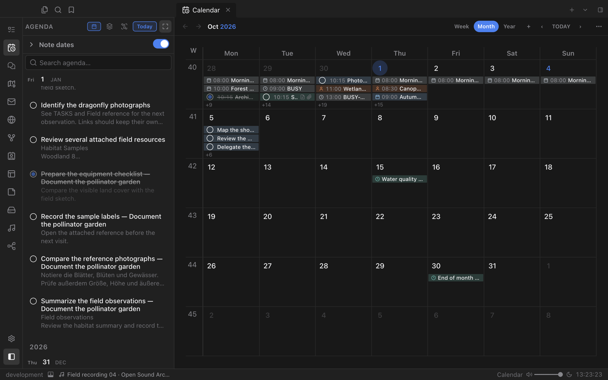
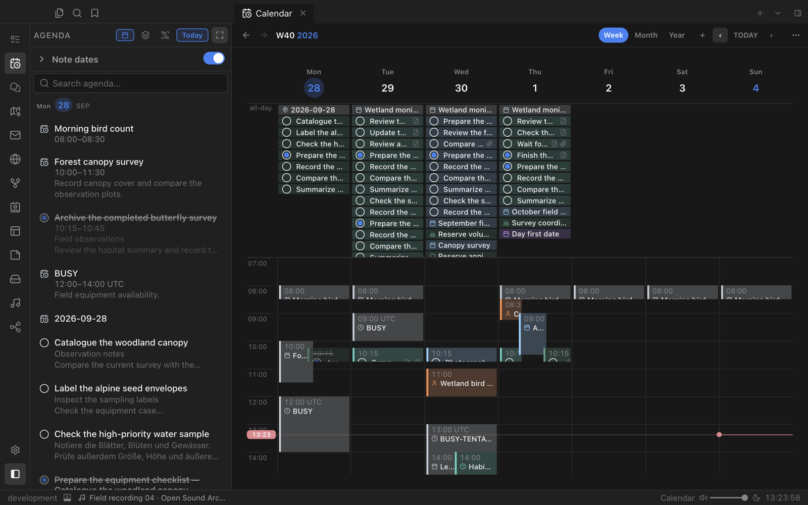
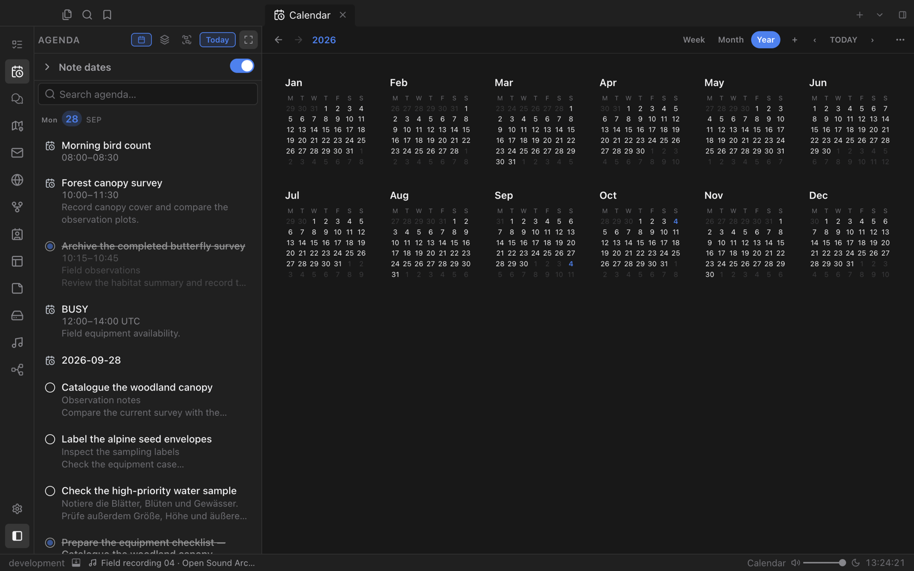
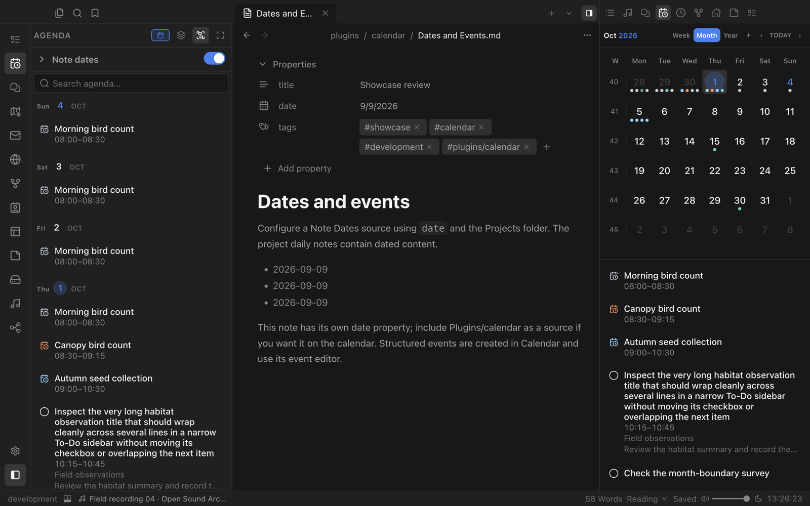

# Calendar

Plan your days with events, dated notes and tasks in one place: a full month, week and year view beside a live agenda, and a compact calendar that follows you in the sidebar.

## Month, week and year

Switch between **Week**, **Month** and **Year** with one click. The agenda column next to the grid lists what is coming up, with tasks you can tick off right there.

The week view shows timed events on an hourly grid, with all-day items and tasks above it and a line for the current time.

## Always in reach

Open Calendar in the right sidebar to keep a compact month and the day's agenda next to whatever you are writing. The main calendar and the sidebar keep their own view, so changing one never resets the other.

## Your files, your dates

- **Calendar files.** `.ics`, `.ifb` and `.vcs` files in your Calendar folder open in an editable view, with recurrence, exceptions and time zones kept intact.
- **Note dates.** Notes with a date property, such as daily notes or project meetings, appear on their day.
- **From other plugins.** To-Do tasks and Contacts birthdays show up automatically, each with its own icon.

Everything stays in your vault. Calendar does not sign in to accounts or sync remote calendars.
